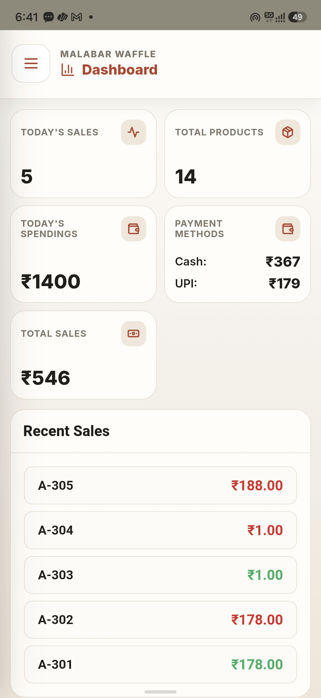
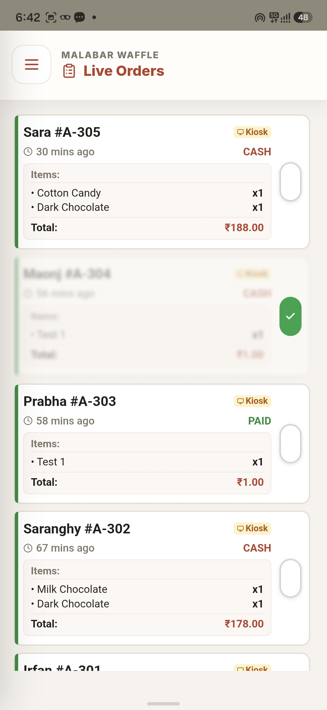
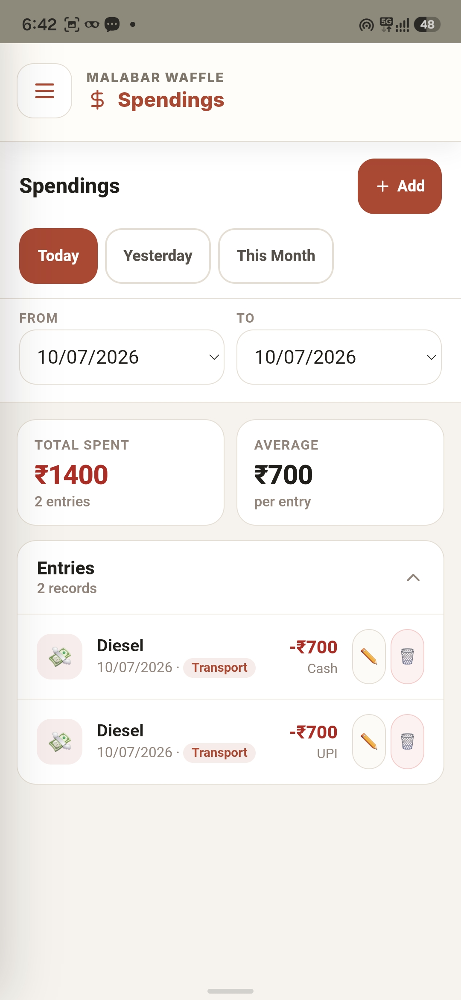
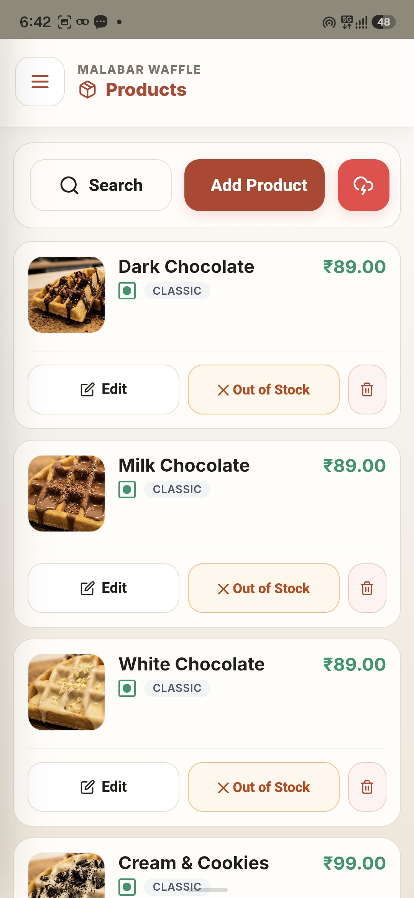
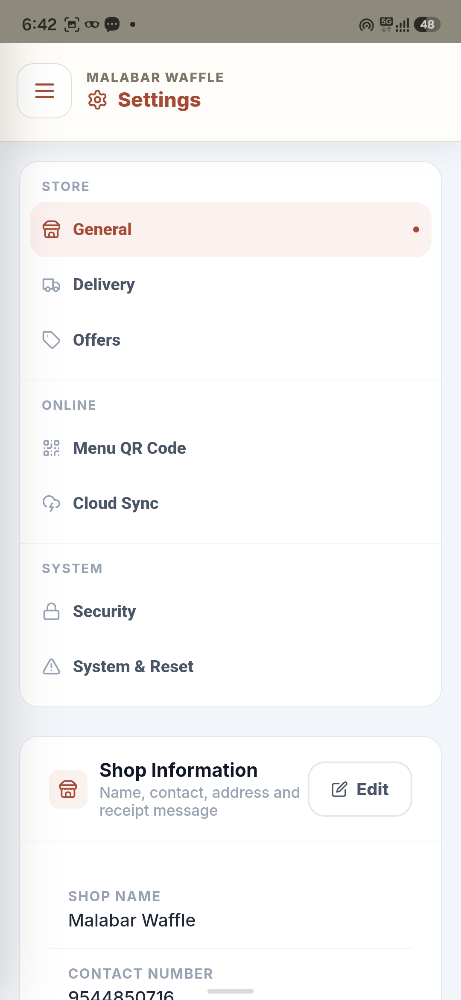
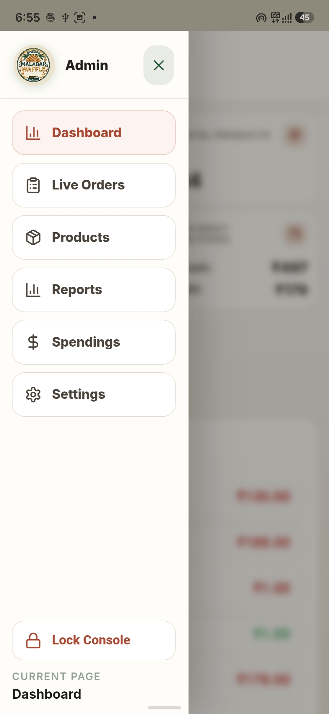
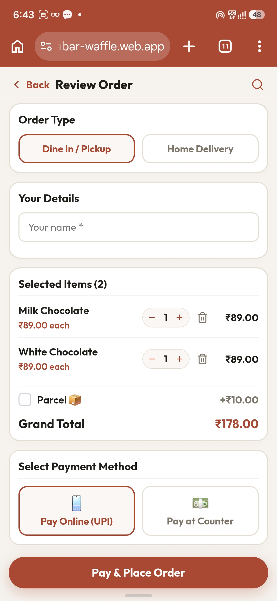
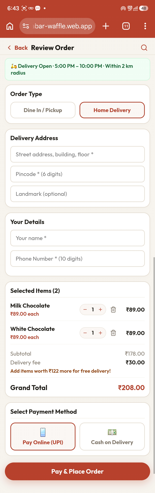
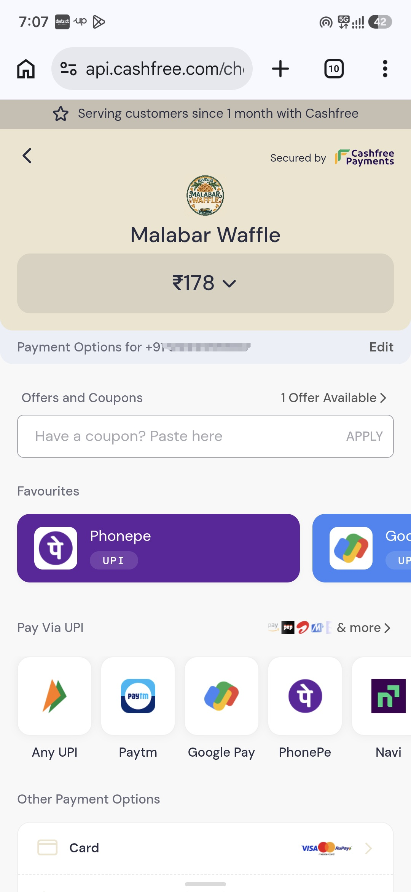

# Malabar Waffle POS & Online Ordering System

A comprehensive, production-ready business management solution built specifically for **Malabar Waffle**. This system powers both the internal Android POS (Point of Sale) and the customer-facing online ordering web application, all seamlessly synchronized in real-time.

## 🌟 Real-World Showcase: Malabar Waffle

### 📱 Admin Application (POS & Management)

| Dashboard & Overview | Live Order Tracking | Spendings & Expenses |
|:---:|:---:|:---:|
|  |  |  |

| Menu Management (Products) | Sales Reports |
|:---:|:---:|
|  |  |

| Settings | App Navigation |
|:---:|:---:|
|  |  |

### 🌐 Customer Web App (Online Ordering)

Seamlessly integrated with the POS, the customer web app allows real-time orders directly into the kitchen's live order queue. Features Cashfree payment integration for secure online transactions.

| Order for Pickup/Dine-In | Order for Home Delivery | Payment Integration |
|:---:|:---:|:---:|
|  |  |  |

## ✨ Architecture & Tech Stack

This project is divided into two main components:

### 1. Admin POS Application (Mobile/Tablet)
- **Framework:** React 18
- **Platform Wrapper:** Capacitor 8 (compiles to native Android APK)
- **Local Storage:** Dexie.js (IndexedDB) for robust offline-first capabilities
- **Real-time Sync:** Firebase Firestore for receiving live online orders
- **Features:** 
  - Live Order Queue tracking online and in-store orders
  - Product & Menu catalog management
  - Comprehensive Sales Reports & Analytics
  - Expense (Spendings) tracking
  - Table Management & POS billing
  - Thermal Printer (ESC/POS) support
  - Automated PDF report generation & Emailing (Node-cron & Nodemailer)

### 2. Customer Website (Online Ordering)
- **Framework:** React 19 & Vite (`/customer-website`)
- **Backend:** Firebase Firestore (syncs directly to the Admin POS)
- **Payments:** Cashfree Payment Gateway integration
- **Features:**
  - Browse menu categories & variants
  - Dine-in / Pickup / Home Delivery order routing
  - Real-time order status updates
  - Clean, mobile-first responsive design

## 🚀 Installation & Setup

### Prerequisites
- Node.js (v18 or higher)
- Android Studio (for compiling the POS app)
- Firebase Account (for real-time database)

### Setup the Admin App
1. Clone the repository and install dependencies:
   ```bash
   npm install
   ```
2. Start the development server:
   ```bash
   npm start
   ```
3. Sync and build for Android:
   ```bash
   npm run build
   npx cap sync
   npm run android:open
   ```

### Setup the Customer Website
1. Navigate to the website directory:
   ```bash
   cd customer-website
   npm install
   ```
2. Start the Vite development server:
   ```bash
   npm run dev
   ```

## ⚠️ Legal Notice

This software is a proprietary implementation of CounterFlow POS.
See the [LICENSE](LICENSE) file for detailed terms and restrictions.

---

**Built with ❤️ for real-world businesses | Powered by CounterFlow POS**
