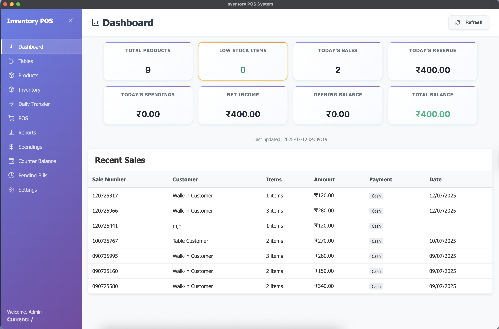
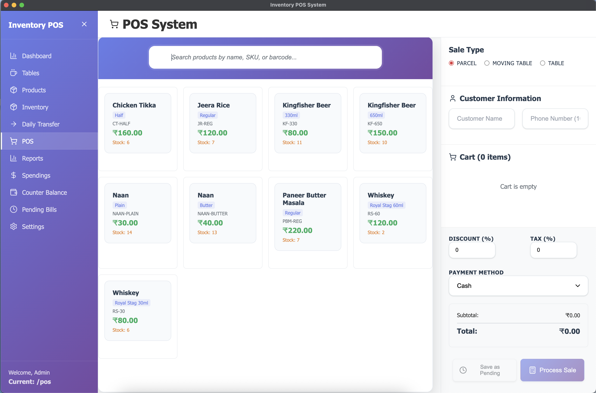
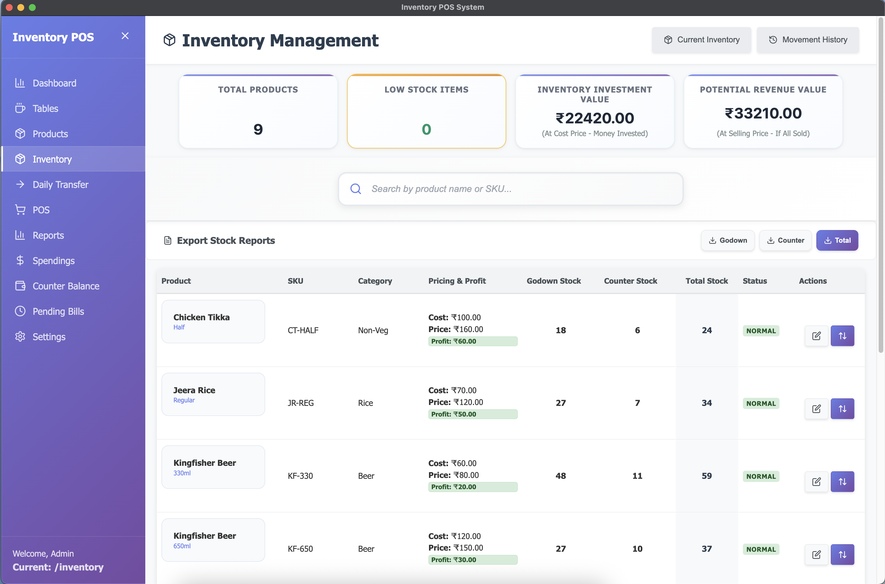
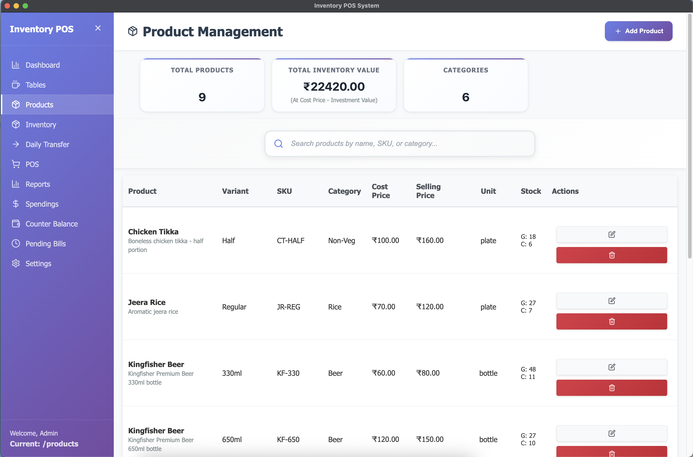
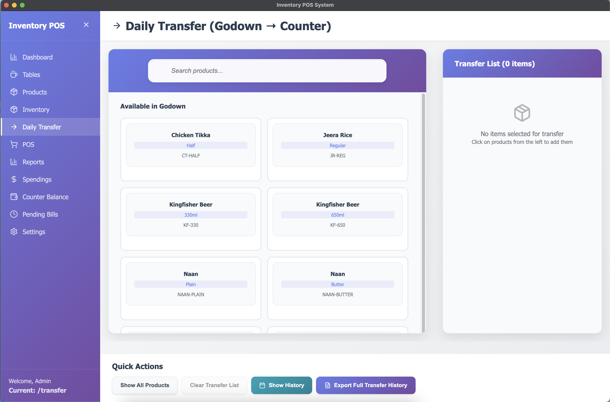
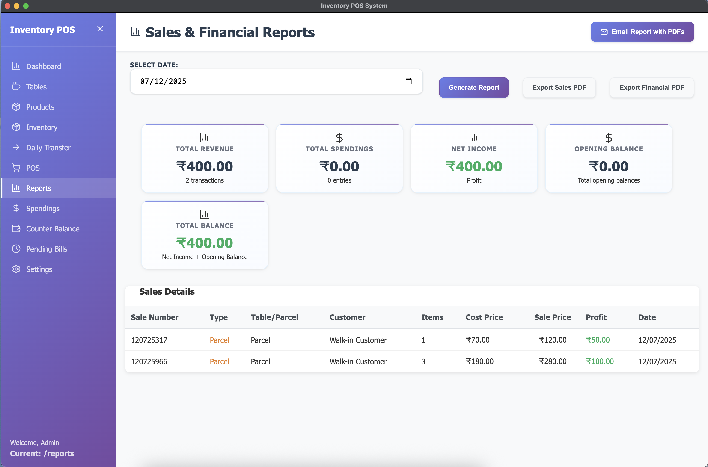
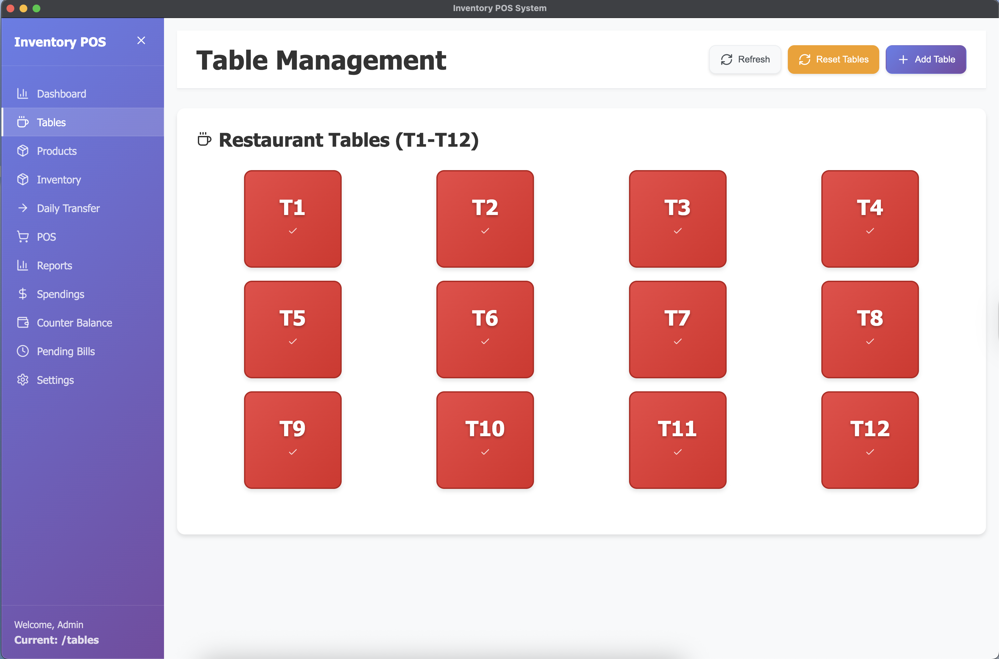
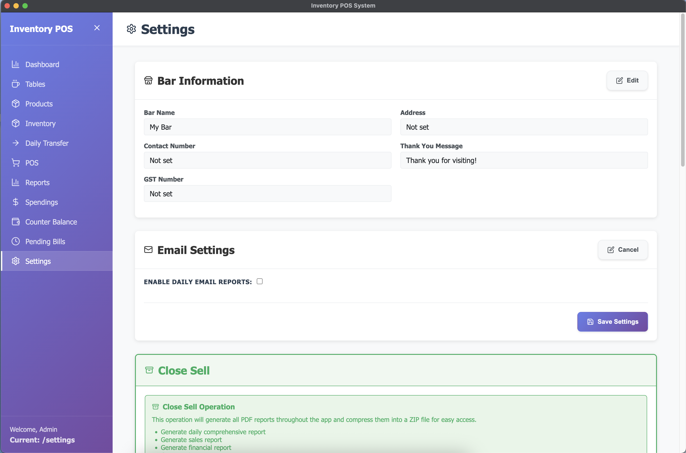

# CounterFlow POS | Advanced Inventory Management and Point of Sale Application

🏆 **The ultimate Point of Sale (POS) and Inventory Management System for Restaurants, Bars, and Retail**

CounterFlow POS is a comprehensive, production-ready business management solution catered specifically for restaurants, bars, and retail establishments. It offers advanced stock management, professional hardware integration, automated reporting, and robust financial tracking.

## 🎥 Demo Video

[](https://youtu.be/axBFug2R3Dg)

**Watch the complete walkthrough** of CounterFlow POS showcasing all major features including POS system, inventory management, table management, sales reports, and thermal printer integration.

[🎬 **Watch on YouTube**](https://youtu.be/axBFug2R3Dg)


## 📸 Screenshots

### Dashboard

*Main dashboard showing business overview, key metrics, and quick access to all modules*

### POS System

*Point of sale interface with product selection, cart management, and billing*

### Inventory Management

*Stock management with godown and counter stock tracking*

### Product Management

*Product catalog management with variants and pricing*

### Daily Transfer

*Stock transfer interface from godown to counter*

### Sales Reports

*Comprehensive sales analytics and reporting*

### Table Management

*Restaurant table layout and order management*

### Settings

*Application configuration and system settings*

## ✨ Key Highlights

- 📱 **Cross-Platform Mobile Application** - Native Android and Web support via Capacitor
- 📊 **Real-time Business Analytics** - Live dashboards and automated reports
- 🖨️ **Professional Hardware Integration** - ESC/POS thermal printer support
- 📧 **Enhanced Email System** - Automated daily reports with improved settings management
- 💾 **Robust Offline Database** - Dexie (IndexedDB) for reliable browser and mobile storage
- 🎯 **Production Ready** - Comprehensive error handling, logging, and mobile compatibility

## 🚀 Core Features

### 📦 Business Management Modules

#### 1. 🏪 Advanced Inventory Management
- **Product Catalog**: Complete product management with variants (sizes, types)
- **Dual Stock System**: 
  - **Godown Stock**: Master inventory from suppliers
  - **Counter Stock**: Ready-to-sell operational stock
- **Smart Stock Transfers**: Bulk transfer with validation and audit trail
- **Automatic Updates**: Real-time stock updates on sales and transfers
- **Low Stock Alerts**: Visual warnings and automated notifications
- **Stock Movement Audit**: Complete history of all stock changes
- **Barcode Support**: SKU and barcode management
- **Category Management**: Organize products by categories

#### 2. 💰 Point of Sale (POS) System
- **Dual Sale Types**: Table service and takeaway/parcel orders
- **Smart Product Selection**: Quick search with counter stock validation
- **Advanced Cart Management**: Add, remove, modify quantities with live totals
- **Flexible Billing**: Tax, discount, and multiple payment method support
- **Payment Methods**: Cash, Card, UPI, Cheque, Credit
- **Professional Bill Generation**: PDF export and thermal printer support
- **Customer Management**: Optional customer details and phone tracking
- **Sale Validation**: Prevents overselling with stock checks

#### 3. 🍽️ Restaurant Table Management
- **Table Layout**: Visual table management for restaurant/bar areas
- **Table Status Tracking**: Available, occupied, reserved states
- **Order Management**: Save and resume table orders
- **Table-Specific POS**: Dedicated interface for table orders
- **Bill Management**: Track current bill amounts per table
- **Capacity Management**: Set table capacity and area designation

#### 4. 📊 Advanced Sales Analytics
- **Real-time Sales Tracking**: Live sales monitoring with detailed records
- **Comprehensive Sale History**: Complete transaction records with search/filter
- **Customer Analytics**: Track customer preferences and order history
- **Payment Analysis**: Breakdown by payment methods
- **Time-based Reports**: Daily, weekly, monthly sales analysis
- **Top-selling Items**: Analytics on best-performing products

#### 5. 📈 Professional Reporting Suite
- **Daily Sales Reports**: Comprehensive daily business summaries
- **Financial Reports**: Revenue, expenses, profit/loss analysis
- **Inventory Reports**: Stock levels, low stock, and movement reports
- **Transfer Reports**: Daily transfer history and summaries
- **Custom Date Ranges**: Flexible reporting periods
- **PDF Export**: Professional report generation
- **Email Automation**: Scheduled daily reports with attachments

#### 6. 🔄 Smart Daily Transfer System
- **Visual Transfer Interface**: Intuitive drag-and-drop style transfers
- **Bulk Operations**: Transfer multiple items simultaneously
- **Quantity Validation**: Prevents over-transfer with real-time checking
- **Transfer History**: Complete audit trail of all transfers
- **Automated Scheduling**: Set up recurring transfer patterns
- **Stock Optimization**: Suggestions for optimal transfer quantities

#### 7. 💳 Financial Management
- **Daily Counter Balance**: Opening and closing balance tracking
- **Expense Management**: Categorized business expense tracking
- **Spending Analytics**: Expense analysis by category and date
- **Profit/Loss Calculation**: Automated financial calculations
- **Cash Flow Tracking**: Daily cash movement monitoring
- **Financial Reports**: Comprehensive financial summaries

#### 8. 📋 Pending Bills Management
- **Save Bills for Later**: Hold orders for future completion
- **Bill Modification**: Edit saved bills before completion
- **Customer Association**: Link bills to customer information
- **Bulk Operations**: Mass operations on pending bills
- **Bill Templates**: Save common orders as templates
- **Expiration Tracking**: Monitor old pending bills

## 🖨️ Hardware Integration

### Thermal Printer Support
- **ESC/POS Protocol**: Full compatibility with standard thermal printers
- **Multiple Connection Types**: USB, Network (IP), and Serial port connections
- **Popular Models**: Epson TM-T82II, TM-T88V, TM-T20, and other ESC/POS printers
- **Dynamic Bill Sizing**: Automatic height adjustment based on bill content
- **Professional Formatting**: Clean, readable receipts on 80mm thermal paper
- **Printer Management**: Status monitoring, configuration, and reconnection
- **Fallback Support**: Graceful degradation when printer unavailable

### Configuration Options
- **USB Printers**: Auto-detection of connected USB thermal printers
- **Network Printers**: IP-based printers (default: 192.168.1.100:9100)
- **Serial Printers**: Serial port printers (default: /dev/ttyUSB0 at 9600 baud)
- **Paper Settings**: 80mm width, 32 characters per line
- **Print Features**: Auto-cut, optional beep, status indicators

## 📧 Automated Email System

### Daily Business Reports
- **Scheduled Reports**: Automatic daily emails at 11:59 PM
- **Professional Templates**: HTML email templates with business branding
- **PDF Attachments**: Multiple report types as PDF attachments
- **Comprehensive Data**: Sales, inventory, financial, and operational metrics
- **Secure Configuration**: Encrypted password storage for email accounts

### Email Features
- **SMTP Support**: Compatible with Gmail, Outlook, and other providers
- **Multiple Recipients**: Send reports to multiple stakeholders
- **Attachment Management**: Automatic PDF generation and cleanup
- **Connection Testing**: Verify email settings before deployment
- **Enhanced Settings Management**: Improved email configuration with reset functionality
- **Error Handling**: Robust error handling with retry mechanisms

## 📄 Professional Bill Format

The system generates professional bills with dynamic formatting:

```
================================
          AJIT WINES
      [Address & Contact]
      GST: [GST Number]
================================
Date: DD/MM/YYYY    Time: HH:MM
Bill No: INV-2024-0001
Table: T1 / Parcel: P001

Customer: [Name]
Phone: [Number]
================================
Item             Qty  Rate Amount
--------------------------------
Kingfisher 330ml  2   120   240
Chicken Tikka     1   180   180
Naan             2    45    90
--------------------------------
Subtotal:                  510
Tax (5%):                   26
Discount:                  -10
--------------------------------
TOTAL:               ₹ 526
================================
Payment: Cash
Thank you for visiting!
================================
```

## Technology Stack

- **Frontend**: React 18 with Lucide React icons
- **Platform Layer**: Capacitor 8 (Mobile App wrapper)
- **Database**: Dexie.js (IndexedDB wrapper) for reliable local client-side storage
- **PDF Generation**: jsPDF with AutoTable for professional reports
- **Styling**: Custom CSS with responsive design
- **Development Tools**: ESLint, Prettier for code quality
- **Email**: Nodemailer with config management
- **Scheduling**: Node-cron for automated tasks

## Installation & Setup

### Prerequisites
- Node.js (v18 or higher)
- npm or yarn package manager
- Android Studio (for compiling the Android app)

### Installation Steps

1. **Clone the repository**
   ```bash
   git clone <repository-url>
   cd inventory-pos-app
   ```

2. **Install dependencies**
   ```bash
   npm install
   ```

3. **Start the development server**
   ```bash
   npm start
   ```
   This will start the React development server in your default browser.

4. **Sync with Android platform**
   ```bash
   # Build the React application
   npm run build
   
   # Sync assets and plugins with Android project
   npm run android:sync
   ```

5. **Open Android Studio**
   ```bash
   npm run android:open
   ```
   From Android Studio, you can run the app on a connected physical device or emulator, or build a release APK/AAB.

## Usage Guide

### Getting Started

1. **Dashboard**: Overview of key metrics and quick access to all modules
2. **Products**: Add and manage your product catalog manually (Menu starts empty)
3. **Inventory**: View and manage stock levels
4. **Daily Transfer**: Transfer stock from godown to counter
5. **POS**: Process sales and generate bills
6. **Reports**: View sales and inventory reports

### Daily Workflow

1. **Morning Setup**:
   - Check inventory levels
   - Transfer required stock from godown to counter
   - Review low stock alerts

2. **During Operations**:
   - Use POS system for all sales
   - Select Table or Parcel as appropriate
   - Generate bills and receipts

3. **End of Day**:
   - Review daily sales report
   - Check remaining stock levels
   - Plan next day's transfers

## Database Schema

The application uses IndexedDB (via Dexie) with the following main stores:
- **products**: Product catalog
- **inventory**: Stock levels tracking
- **sales**: Sales transactions
- **spendings**: Business expenses
- **tables**: Area and table status management
- **bar_settings**: Business and printer configurations

## File Structure

```
src/
├── components/           # React components
│   ├── Dashboard.js     # Main dashboard
│   ├── ProductManagement.js
│   ├── InventoryManagement.js
│   ├── DailyTransfer.js
│   ├── POSSystem.js
│   ├── SalesReports.js
│   └── ...
├── services/
│   ├── dbService.js     # Unified Dexie IndexedDB access layer
│   └── whatsappService.js
├── pdf-service.js      # PDF generation
├── printer-service.js  # Printing functionality
├── App.css            # Styling
└── index.js           # Entry point
```

## Support

For technical support or feature requests, please contact the development team.

**Contact Information:**
- Email: ajitreddy013@gmail.com
- Phone: +91 7517323121

## Recent Updates

### Version 1.0.0 - Android/Capacitor Migration (2026)
- 📱 **Migrated platform** from Electron desktop to Android mobile and web app via Capacitor
- 💾 **Adopted IndexedDB (Dexie)** as the primary offline storage engine
- 🗑️ **Removed Electron dependencies** and native SQLite3 bindings to reduce build size and increase performance
- 🔧 **Enhanced email settings** with improved reset functionality
- 🧹 **Code quality improvements** and dynamic environment detection in UI settings

## ⚠️ IMPORTANT LEGAL NOTICE

**ALL RIGHTS RESERVED** - This software is **PROPRIETARY** and **CONFIDENTIAL**.

🚫 **UNAUTHORIZED USE PROHIBITED**
- Commercial use, redistribution, or copying is **STRICTLY FORBIDDEN**
- Creating derivative works or competing systems is **PROHIBITED**
- Reverse engineering or code extraction is **ILLEGAL**
- This code is for **viewing and educational purposes ONLY**

⚖️ **Legal Action**: Unauthorized use may result in legal proceedings.

## License

This software is proprietary and developed specifically for Ajit Wines.
See the [LICENSE](LICENSE) file for detailed terms and restrictions.

---

**Built with ❤️ for Ajit Wines | Powered by CounterFlow POS**

*Last updated: June 18, 2026*
